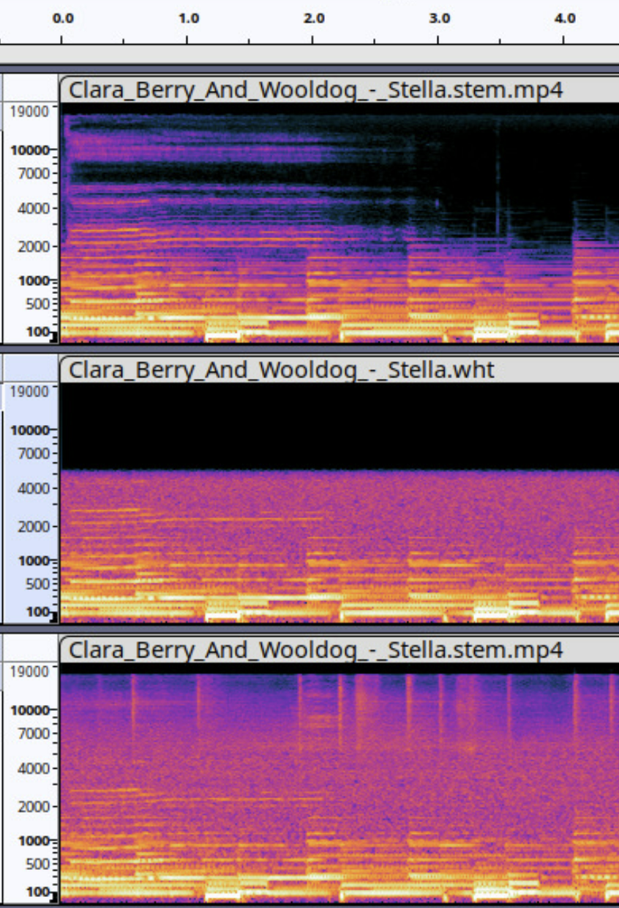

# 1. Introduction

Audio super-resolution (ASR) is the task of converting low-resolution audio signals to high-resolution, enhancing their fidelity, bandwidth, and perceptual quality. This problem is crucial in various fields, including music production, audio restoration, and telecommunication, where audio data often suffers from bandwidth limitations. As deep learning techniques advance, several generative models have emerged, offering new possibilities for tackling ASR with greater accuracy and scalability.  

One such model is AUDIOSR: Versatile Audio Super-Resolution at Scale[@liu2023audiosr], which leverages a diffusion-based generative framework to reconstruct high-resolution audio from low-resolution inputs.
The model upscales audio bandwidth from 2 kHz to 16 kHz and generates high-fidelity output with a bandwidth of 24 kHz and a sampling rate of 48 kHz. This approach marks a significant step forward in the domain of ASR by effectively capturing the complex temporal and spectral characteristics of audio signals.
The AUDIOSR model builds upon earlier work by Haohe Liu, particularly the AudioLDM[@liu2023audioldm] framework. AudioLDM was initially designed to convert text to audio by conditioning audio generation on text during the training process. It introduces a novel combination of Variational Autoencoders (VAE), Contrastive Language-Audio Pretraining (CLAP), latent diffusion models, and audio vocoders to synthesize high-quality audio. While AudioLDM focuses on text-conditioned audio generation, AUDIOSR extends these ideas specifically to bandwidth extension and high-resolution audio reconstruction, focusing on the audio domain, but now with audio-conditioning instead of text-conditioning.
In this project, we aimed to recreate the AUDIOSR model and extend its capabilities. Our work introduces several modifications to improve the versatility and performance of the model, including adjustments to the training process, to train on different distortions and noises. This paper presents the details of our implementation, the enhancements we introduced, and a comprehensive evaluation of the model's performance.

# 2. Literature Review
One notable approach in the field of audio enhancement is presented by Mostafa Sadeghi in "Audio-visual Speech Enhancement Using Conditional Variational Auto-Encoders" [@Sadeghi2019CVAE] This study introduces a novel method leveraging Conditional Variational Auto-Encoders (CVAEs) for improving audio quality through the integration of visual information. The method employs a dual VAE architecture, with one VAE dedicated to processing audio and another to analyzing the visual representation of the speaker's lips.

The core innovation of this approach lies in the conditioning of the audio VAE on the visual VAE. By using lip movement data as a conditional input, the model enhances the audio signal more effectively on the additional contextual information provided by the visual data. This approach mirrors the concepts explored in our project on audio super resolution (AudioSR), where high-resolution audio is learned conditionally based on low-resolution audio, with both signals encoded using VAEs. The integration of visual data for audio enhancement highlights the potential of using multi-modal information to improve audio quality.

Another significant contribution to the field is presented by Huajian Fang in "Variational Autoencoder for Speech Enhancement with a Noise-Aware Encoder" [@Fang2021VAE]. This study addresses the challenge of noise reduction in speech enhancement through a sophisticated VAE-based approach. Fang’s method involves training two distinct VAEs: one for clean audio and another for noisy audio. The purpose of this dual VAE system is to encode both clean and noisy audio into separate latent spaces.

A key aspect of this approach is the use of Kullback-Leibler (KL) divergence to align the latent representations of noisy audio with those of clean audio. By minimizing the divergence between these latent spaces, the model effectively reduces the influence of noise, resulting in enhanced speech quality. This noise-aware encoding technique demonstrates a robust method for improving audio clarity by refining the latent space representations. The concept of aligning noisy and clean latent spaces shares similarities with our exploration of conditional learning in AudioSR, underscoring the relevance of advanced VAE techniques for effective audio enhancement.

# 3. Problem Formulation And Method
Given an analog signal that has been discretely sampled at a rate of $l$ samples per second, resulting in a low-resolution sequence of values. The goal of audio super resolution (SR) is to estimate a higher resolution signal sampled at a rate of $h$ samples per second, where $h > l$. According to Nyquist’s theory, the low resolution signal have maximum frequency
bandwidths of  $l/2 Hz$ and the high resolution signal have $h/2 Hz$. Therefore, the information contained between frequencies of $h/2 − l/2 Hz$ is missing from the low resolution signal. Estimating the “missing” frequency data is the core objective of the SR task.

As outlined in the introduction, the entire AUDIOSR model builds upon the author's previous work, AUDIOLDM. The architecture of AUDIOLDM consists of several key components. First, the high-resolution audio is converted into a Mel spectrogram, which is then encoded using a Variational Autoencoder (VAE) to generate a latent space representation. Simultaneously, the audio is encoded using the CLAP model to produce a one-dimensional vector. Additionally, any conditional text is also encoded using CLAP to create its own one-dimensional vector representation.

Each encoded component—both the audio and the conditional text—is then passed through the latent diffusion model, where sampling occurs. Importantly, each part of the architecture is trained separately in a sequential manner. Once processed, the data is passed through the VAE decoder to reconstruct the Mel spectrogram. Finally, this spectrogram is fed into a neural vocoder, which converts the Mel spectrogram back into an audible audio signal.

This approach allows the model to learn the relationship between text and sound, enabling it to generate audio from text input.

In our experiment, to match the methodology described in the AUDIOSR paper, we replaced the text-based conditioning with a low-resolution audio signal with noise addition . Furthermore, instead of using CLAP encodings for the high- and low-resolution audio signals, we employed a VAE (Variational Autoencoder) encoder. The latent spaces generated by the two VAE encoders for both high- and low-resolution signals were concatenated into a single latent space, which was then used as input to the latent diffusion model.

The loss function presented in the AudioSR paper aims to minimize the difference between the predicted velocity $v_k$ at a given diffusion step $k$ and the actual velocity derived from a combination of the noise schedule and the true signal $x_0$.

The general form of the loss function is:
$$\arg\min_{G_\theta} \|v_k - G(z_k, k, \mathcal{F}_{\text{enc}}(X_l); \theta)\|_2^2$$

$v_k$ represents the velocity term at the diffusion step $𝑘$
which is computed based on both the current estimate of the noise and the original latent representation $z_0$.
$z_k$ is the latent variable at step $𝑘$ generated by the VAE encoder of the original high resolution audio signal.
$G(z_k, k, \mathcal{F}_{\text{enc}}(X_l)$ is the model's prediction, which depends on the latent diffusion model (a U-Net structure), the latent variable $z_k$, and the encoder $\mathcal{F}_{\text{enc}}(X_l)$ which transforms the low-resolution spectrogram $X_l$ into a latent space representation. The input to $G$ is obtained by concatenating the two latent sapces created by the VAE encoders $z_k$ and $\mathcal{F}_{\text{enc}}(X_l)$. 

The velocity $v_k$ is calculated using the following formula:

$v_t = \sqrt{\bar{\alpha}_t} \epsilon - \sqrt{1 - \bar{\alpha}_t} x_0$

This formula represents a weighted mixture of the noise component $\epsilon$ and the original signal $x_0$. Where ${\bar{\alpha}_t}$ is part of the noise schedule, which determines how much noise is added at each step.
Thus, the model's goal is to learn to predict the velocity term by minimizing the difference between the true velocity $v_k$ and the model's predicted velocity, using the latent diffusion model $G$. This is done by minimizing the Euclidean distance between the two terms.

# 4. Preprocessing
In our study, we first apply a low-pass filter to the audio signal, following the procedure outlined in AUDIOSR. The cutoff frequency for the low-pass filter is randomly selected from a uniform distribution between 2 kHz and 16 kHz. To ensure the robustness and generalization of the filtering process, the type of low-pass filter is also chosen randomly from four different filter designs: Chebyshev, Elliptic, Butterworth, and Boxcar. The order of the filter is selected randomly from an integer range between 2 and 10. This variability in the filter selection is crucial to replicate the diverse conditions observed in the referenced work and to address the filter generalization problem.

After filtering, we added noise to the waveform, randomly selecting between single-tone noise and Gaussian white noise. For both types, the amplitude is sampled from a uniform distribution. The amplitude range for single-tone noise is set between 0.001 and 0.2, while for Gaussian noise it is limited to 0.001 to 0.02, as Gaussian noise affects the entire spectrum of the audio signal. The center frequency for the single-tone noise is uniformly sampled between 100 Hz and 15 kHz.

# 5.Data
The dataset used in this paper is MUSDB18 [@musdb18]. MUSDB18 consists of 150 full-length music tracks, totaling approximately 10 hours of audio, with a dataset size of 4.4 GB. It is widely regarded as a benchmark for music source separation tasks. The dataset includes a collection of professionally produced songs spanning various genres, such as rock, pop, jazz, and electronic music. Each track is provided as a multitrack audio file, where the individual musical components are separated into distinct "stems," including vocals, drums, bass, and other instruments. One of these stems contains the mixture of all components, which we used for training purposes in this work.

# 6.Experiment
In our experiment we divided the dataset as follow: 90 tracks were used for the training, 10 for validation and 50 tracks for the test. We used a single NVIDIA   GPU with 24GB VRAM. We followed the processes mentioned in the Problem Formulation And Method section [section 3] and in the Preprocessing section [section 4] to create the AUDIOSR architecture using the AUDIOLDM architecture with the additional noise components to the conditional part as demonstrated in Fig.2. The model was trained for 300 epochs and batch size of 10. We used the author's provided checkpoints to resume training from where they left off, aiming to enhance the model and add new features like noise and distortion cancellation. It is worth mentioning that before performing the experiment, we did an earlier experiment where we trained the model only with single tone noise for 17,000 epochs.

# 7.Results
We successfully ran the AUDIOSR model without adding noise and achieved results comparable to those reported by the authors. Upon introducing noise, we found that the model was more effective at cleaning single-tone noise compared to white noise. Part of it is because the model trained much longer on single tone noise than on white noise. For both noise types, the model performed better at removing noise at higher frequencies. Additionally, when the audio signal had a lower amplitude, the model was more efficient at distinguishing and separating the signal from the noise.

Let us see some results from the early training. The order of the spectograms are always: Ground truth on top, distorted audio in the middle and restored audio on the buttom.

We can see that in the early stage of training, the model does not manage to get rid of any type of the noises.
After training the model for a longer time we can see the results:

After training on noisy audio, the model was able to completely eliminate the single-tone noise. In contrast, it only reduced white noise in areas where the audio signal had lower amplitude. As noted in the Experiment section [Section 6], the model was trained significantly longer on single-tone noise than on white noise, making it more effective at handling single-tone noise. With more training time on white noise, the results for white noise reduction could likely have been much improved.

In the next graph we would see the training loss of the model:

We ran multiple iterations of the training process. The orange trace represents the model training exclusively on single-tone noise, where we observe loss convergence, indicating the model is learning to eliminate the single-tone noise. Following that, the blue, green, and red traces represent runs where the model trained on a random choice between white noise and single-tone noise. When white noise was introduced, the loss immediately spiked to higher values due to the drastic change in input. Additionally, the training on white noise did not converge, likely because there was insufficient time for it to do so.

To evaluate the model, we used the LSD (Log-Spectral Distance) metric, as was done in the original article. In Fig. [?????], we can see that the LSD of our model averages between 1.2 and 2, depending on the type of noise, the noise amplitude, and the cutoff frequency of the low-resolution audio input.

comparing to the author results and results of LSD of other articles about audio super resolution:

| Model      |     LSD    | 
|------------|------------|
| GT-Mel     |  0.61      | 
| Unprocessed| 1.99-4.25  | 
| NVSR-DNN   | 1.13- 1.67 | 
| NVSR-ResUNet | 1.7- 0.95| 
| AUDIOSR    | 0.99- 0.73|
| AUDIOSR + Noise (our model) | 2 - 1.2| 

Where LSD lower values indicate superior
performance. As expected, our model performs worse than the original AudioSR because we introduced additional noise to the input, further distorting the signal. However, our results are not far behind NVSR-DNN, NVSR-ResUNet, and AudioSR, suggesting that the model is still effective at predicting higher frequencies and in noise reduction, particularly when the noise amplitude is not too high.

# 8.Conclusion
The model demonstrated positive results in noise removal, even with low-resolution audio. It was more effective at reducing single-tone noise than white noise, likely due to longer training on the former. The model is versatile, and with minor adjustments, it can be adapted to handle additional features and different types of noise. Throughout this project, we gained valuable insights not only into Variational Autoencoders, our main focus, but also into Diffusion models, model configurations, and training large-scale models.

# 9.Future Work
For future work, we plan to continue training the model on Gaussian noise to evaluate whether it can achieve better results in noise reduction. Additionally, we aim to explore audio inpainting, an experiment we were unable to conduct, where parts of the audio signal are removed, and the model attempts to reconstruct the missing portions. This could further enhance the model’s ability to handle more complex audio restoration tasks.

# References

::: {#refs}
:::